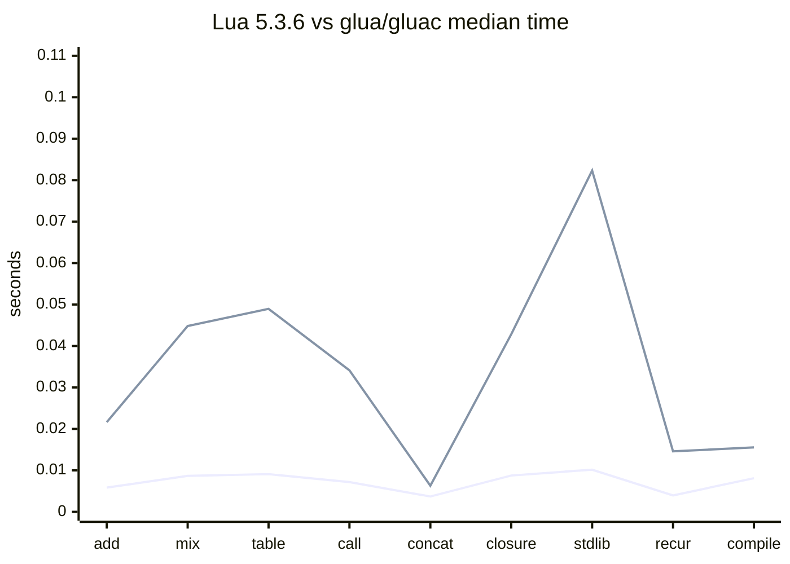
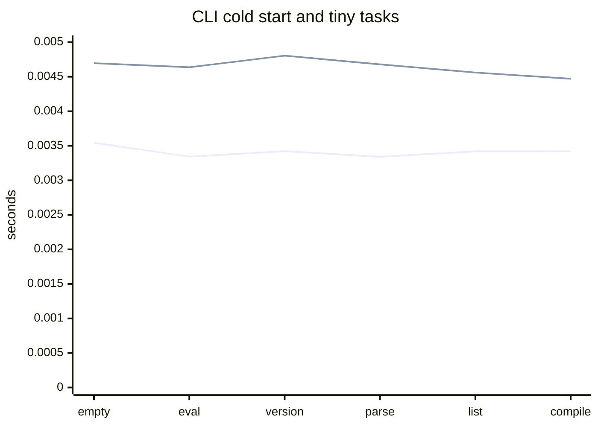

# Benchmark 基线

本文记录当前纯 Go Lua 5.3 VM 的首个 runtime benchmark 基线，用于后续优化、回归和发布前对比。

## 执行环境

- 日期：2026-06-27
- 命令：`CGO_ENABLED=0 go test ./runtime -run=^$ -bench=. -benchtime=100ms`
- OS/Arch：`darwin/arm64`
- CPU：`Apple M1 Max`
- Go：项目 `go.mod` 声明 `go 1.26` 与 `toolchain go1.26.4`
- CGO：关闭

## 结果

```text
BenchmarkVMDispatch-10                         37104798      3.120 ns/op       0 B/op   0 allocs/op
BenchmarkTableReadWrite/raw_set_integer-10     23011464      5.130 ns/op       0 B/op   0 allocs/op
BenchmarkTableReadWrite/raw_get_integer-10     24501250      4.926 ns/op       0 B/op   0 allocs/op
BenchmarkGoFunctionCall-10                      2480064     49.25 ns/op      128 B/op   2 allocs/op
BenchmarkStringConcat-10                        3321932     35.90 ns/op       16 B/op   1 allocs/op
BenchmarkGoLuaCallback-10                        509391    268.5 ns/op       492 B/op   5 allocs/op
```

## 使用说明

- 该基线只覆盖 runtime 当前已有 benchmark，不代表完整 Lua 5.3 官方测试性能。
- 后续修改 VM dispatch、Table、字符串、Go/Lua 回调和 bridge 层时，应复跑同一命令并记录差异。
- 若硬件、Go toolchain、`benchtime` 或 CGO 设置变化，不能直接与本基线做精确比较。

## 官方 Lua 5.3.6 CLI 对比

### 执行环境

- 日期：2026-06-29
- OS/Arch：`darwin/arm64`
- macOS：`26.5.1`
- CPU：`Apple M1 Max`
- Go：`go version go1.26.4 darwin/arm64`
- CGO：本项目 `glua` / `gluac` 构建时关闭，命令为 `CGO_ENABLED=0 go build -o bin/glua ./cmd/glua` 与 `CGO_ENABLED=0 go build -o bin/gluac ./cmd/gluac`
- 官方 Lua：从 `https://www.lua.org/ftp/lua-5.3.6.tar.gz` 下载完整发布包到 `/tmp`，SHA256 为 `fc5fd69bb8736323f026672b1b7235da613d7177e72558893a0bdcd320466d60`
- 官方 Lua 构建：`make macosx MYCFLAGS='-DLUA_COMPAT_5_2'`
- 说明：仓库内 `third_party/lua-5.3.6/` 当前参考副本缺少 `luac.c`，因此 `luac` 对比使用官方完整发布包构建产物。

### 方法

- 每个用例先各自 warmup 一次，再交替执行官方工具与本项目工具各 5 次。
- 统计 wall-clock elapsed time 的中位数。
- `lua` 对比执行同一份临时 Lua 脚本，并校验 stdout 一致。
- `luac` 对比编译同一份 2500 个全局函数定义的 Lua 源码，并校验两侧均成功写出 chunk。

### 结果

| 用例 | 官方工具中位数 | 本项目中位数 | 本项目/官方 |
| --- | ---: | ---: | ---: |
| `arith_loop` | 0.036815s | 0.923068s | 25.07x |
| `table_rw` | 0.014469s | 0.332654s | 22.99x |
| `function_call` | 0.027137s | 0.965794s | 35.59x |
| `string_concat` | 0.011507s | 1.064175s | 92.48x |
| `compile_2500_global_functions` | 0.007467s | 0.019272s | 2.58x |

### 结论

- 当前 `glua` 已以兼容性验收为第一目标，解释执行性能明显慢于官方 C Lua；算术循环、表读写和 Lua 函数调用约慢 23x 到 36x。
- 字符串连续拼接差距最大，约慢 92x，后续优化应优先检查 `CONCAT` 指令、字符串分配、短字符串驻留和 Lua 字符串 builder 路径。
- `gluac` 编译速度与官方 `luac` 的差距相对较小，当前临时源码编译约慢 2.6x，说明 lexer/parser/codegen 的首轮性能风险低于 VM 执行热路径。
- 该结果是单机、短脚本、wall-clock 基准，不作为发布性能承诺；后续优化需要补充更稳定的 benchmark harness，并分别跟踪 VM 指令分发、表、字符串、函数调用和 binary chunk 编解码。

## 发布验证结论同步

- 当前发布口径仍以 Lua 5.3 行为兼容和 `glua`/`gluac` 官方可执行文件兼容为优先级，不把性能追平官方 C Lua 作为首个 release 阻塞条件。
- VFS、动态库 loader、Go 封装 API 和 reflection 自动绑定属于 Go 嵌入增强能力；它们的验收以 `CGO_ENABLED=0 go test ./...`、`./scripts/check-go-gates.sh`、`docs/RELEASE_VALIDATION_TODO.md` 中列出的专项测试和发布限制文档为准。
- reflection 自动绑定已支持显式 opt-in 的函数和 struct 扫描，但尚未建立独立 benchmark；后续性能专项应补充自动函数调用、字段读写、方法调用与显式 binding 的对比。

## 官方 Lua 5.3.6 全方位对比

### 执行环境

- 日期：2026-06-30
- OS/Arch：`darwin/arm64`
- CPU：`Apple M1 Max`
- 官方 Lua：本机安装的官方 Lua 5.3.6 `lua` 与 `luac`，通过 `LUA_BIN` / `LUAC_BIN` 指定
- 本项目：`./bin/glua` 与 `./bin/gluac`
- 构建命令：`CGO_ENABLED=0 go build -o bin/glua ./cmd/glua` 与 `CGO_ENABLED=0 go build -o bin/gluac ./cmd/gluac`
- 统计口径：每个脚本 warmup 后交替运行 20 次，记录 wall-clock elapsed time 中位数；CLI 冷启动用例运行 30 次。

### 兼容性对比

`LUA_BIN=<lua-5.3.6>/bin/lua LUAC_BIN=<lua-5.3.6>/bin/luac GLUA_BIN=./bin/glua GLUAC_BIN=./bin/gluac ./scripts/compare-official-executables.sh`

该脚本当前未完全通过，差异集中在展示格式而非性能：

- `runtime_error` traceback 文案差异：官方为 `[C]: in function 'error'`，本项目为 `[C]: in global 'error'`。
- `luac -l` 与 `luac -l -l` 列表格式差异：官方 `luac` 使用原生列表格式，本项目 `gluac` 使用自定义反汇编格式。

### 脚本运行性能

| 用例 | 官方 `lua` 中位数 | `glua` 中位数 | `glua`/官方 |
| --- | ---: | ---: | ---: |
| `arith_add_loop` | 0.005855s | 0.021629s | 3.69x |
| `arith_mix_loop` | 0.008665s | 0.044818s | 5.17x |
| `table_rw` | 0.009094s | 0.048963s | 5.38x |
| `function_call` | 0.007181s | 0.034119s | 4.75x |
| `string_concat` | 0.003695s | 0.006298s | 1.70x |
| `closure_upvalue` | 0.008760s | 0.042832s | 4.89x |
| `stdlib_math_string` | 0.010161s | 0.082317s | 8.10x |
| `recursion` | 0.003958s | 0.014580s | 3.68x |
| `compile_3000_functions` | 0.008118s | 0.015539s | 1.91x |



慢速倍数保留在上方表格中，避免把耗时值和倍数值混入同一图表导致阅读误差。

### CLI 冷启动与小任务

| 用例 | 官方工具中位数 | 本项目中位数 | 本项目/官方 |
| --- | ---: | ---: | ---: |
| `lua_empty_script` | 0.003543s | 0.004696s | 1.33x |
| `lua_eval_empty` | 0.003343s | 0.004637s | 1.39x |
| `lua_version` | 0.003422s | 0.004805s | 1.40x |
| `luac_parse_only` | 0.003341s | 0.004679s | 1.40x |
| `luac_list` | 0.003419s | 0.004561s | 1.33x |
| `luac_compile_tiny` | 0.003420s | 0.004471s | 1.31x |



### Go 内部 Benchmark

命令：`CGO_ENABLED=0 go test ./runtime ./lua -run=^$ -bench=. -benchmem -benchtime=3s -count=3`

| 用例 | 当前结果 |
| --- | ---: |
| `BenchmarkVMDispatch` | 约 3.9 ns/op，0 allocs |
| `BenchmarkTableReadWrite/raw_set_integer` | 约 6.3-6.5 ns/op，0 allocs |
| `BenchmarkTableReadWrite/raw_get_integer` | 约 5.2-5.3 ns/op，0 allocs |
| `BenchmarkGoFunctionCall` | 约 46-48 ns/op，128 B/op，2 allocs |
| `BenchmarkStringConcat` | 约 35 ns/op，16 B/op，1 alloc |
| `BenchmarkVMConcatInstruction/binary_string` | 约 25.5 ns/op，8 B/op，1 alloc |
| `BenchmarkVMConcatInstruction/empty_right` | 约 4.5 ns/op，0 allocs |
| `BenchmarkVMConcatInstruction/empty_left` | 约 4.7 ns/op，0 allocs |
| `BenchmarkVMConcatInstruction/four_strings` | 约 40.7-41.0 ns/op，16 B/op，1 alloc |
| `BenchmarkGoLuaCallback` | 约 249-297 ns/op，约 5 allocs |
| `BenchmarkDoStringStringConcat` | 约 0.458-0.472 ms/op，约 2.23 MB/op |
| `BenchmarkDoStringFunctionCall` | 约 0.909-0.910 ms/op，约 108 KB/op |

### 结论

- CLI 冷启动、小脚本和 `gluac` 编译差距较小，约 1.3x 到 1.9x，说明启动和编译器当前不是主要瓶颈。
- 运行时解释执行仍是主要差距：递归约 3.68x，纯加法循环约 3.69x，函数调用和闭包/upvalue 约 4.75x 到 4.89x，表读写约 5.38x。
- 字符串拼接已较 2026-06-29 旧基线明显改善，从约 92x 收窄到约 1.70x。
- 标准库混合路径和混合算术循环是本轮最慢项，分别约 8.10x 与 5.17x；混合算术用例包含乘法、加法、减法和表达式求值，不等同于纯加法循环。后续优先优化方向应集中在 VM 算术热路径、标准库函数调用边界、`CheckContext`/debug frame 同步和 Lua 调用帧复用。
