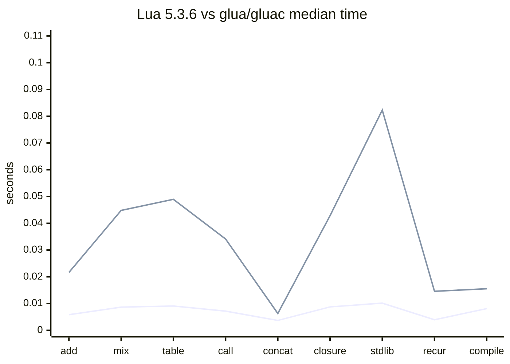
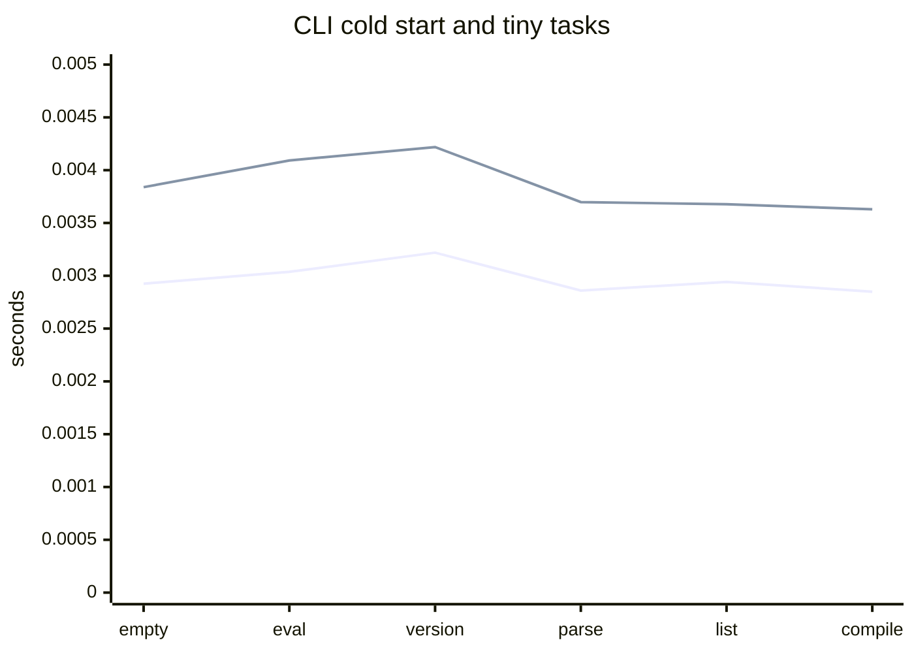

# Benchmark 基线

本文记录当前纯 Go Lua 5.3 VM 的首个 runtime benchmark 基线，用于后续优化、回归和发布前对比。

## 执行环境

- 日期：2026-06-27
- 命令：`CGO_ENABLED=0 go test ./runtime -run=^$ -bench=. -benchtime=100ms`
- OS/Arch：`darwin/arm64`
- CPU：`Apple M1 Max`
- Go：项目 `go.mod` 声明 `go 1.26` 与 `toolchain go1.26.4`
- CGO：关闭

## 结果

```text
BenchmarkVMDispatch-10                         37104798      3.120 ns/op       0 B/op   0 allocs/op
BenchmarkTableReadWrite/raw_set_integer-10     23011464      5.130 ns/op       0 B/op   0 allocs/op
BenchmarkTableReadWrite/raw_get_integer-10     24501250      4.926 ns/op       0 B/op   0 allocs/op
BenchmarkGoFunctionCall-10                      2480064     49.25 ns/op      128 B/op   2 allocs/op
BenchmarkStringConcat-10                        3321932     35.90 ns/op       16 B/op   1 allocs/op
BenchmarkGoLuaCallback-10                        509391    268.5 ns/op       492 B/op   5 allocs/op
```

## 使用说明

- 该基线只覆盖 runtime 当前已有 benchmark，不代表完整 Lua 5.3 官方测试性能。
- 后续修改 VM dispatch、Table、字符串、Go/Lua 回调和 bridge 层时，应复跑同一命令并记录差异。
- 若硬件、Go toolchain、`benchtime` 或 CGO 设置变化，不能直接与本基线做精确比较。

## 官方 Lua 5.3.6 CLI 对比

### 执行环境

- 日期：2026-06-29
- OS/Arch：`darwin/arm64`
- macOS：`26.5.1`
- CPU：`Apple M1 Max`
- Go：`go version go1.26.4 darwin/arm64`
- CGO：本项目 `glua` / `gluac` 构建时关闭，命令为 `CGO_ENABLED=0 go build -o bin/glua ./cmd/glua` 与 `CGO_ENABLED=0 go build -o bin/gluac ./cmd/gluac`
- 官方 Lua：从 `https://www.lua.org/ftp/lua-5.3.6.tar.gz` 下载完整发布包到 `/tmp`，SHA256 为 `fc5fd69bb8736323f026672b1b7235da613d7177e72558893a0bdcd320466d60`
- 官方 Lua 构建：`make macosx MYCFLAGS='-DLUA_COMPAT_5_2'`
- 说明：仓库内 `third_party/lua-5.3.6/` 当前参考副本缺少 `luac.c`，因此 `luac` 对比使用官方完整发布包构建产物。

### 方法

- 每个用例先各自 warmup 一次，再交替执行官方工具与本项目工具各 5 次。
- 统计 wall-clock elapsed time 的中位数。
- `lua` 对比执行同一份临时 Lua 脚本，并校验 stdout 一致。
- `luac` 对比编译同一份 2500 个全局函数定义的 Lua 源码，并校验两侧均成功写出 chunk。

### 结果

| 用例 | 官方工具中位数 | 本项目中位数 | 本项目/官方 |
| --- | ---: | ---: | ---: |
| `arith_loop` | 0.036815s | 0.923068s | 25.07x |
| `table_rw` | 0.014469s | 0.332654s | 22.99x |
| `function_call` | 0.027137s | 0.965794s | 35.59x |
| `string_concat` | 0.011507s | 1.064175s | 92.48x |
| `compile_2500_global_functions` | 0.007467s | 0.019272s | 2.58x |

### 结论

- 当前 `glua` 已以兼容性验收为第一目标，解释执行性能明显慢于官方 C Lua；算术循环、表读写和 Lua 函数调用约慢 23x 到 36x。
- 字符串连续拼接差距最大，约慢 92x，后续优化应优先检查 `CONCAT` 指令、字符串分配、短字符串驻留和 Lua 字符串 builder 路径。
- `gluac` 编译速度与官方 `luac` 的差距相对较小，当前临时源码编译约慢 2.6x，说明 lexer/parser/codegen 的首轮性能风险低于 VM 执行热路径。
- 该结果是单机、短脚本、wall-clock 基准，不作为发布性能承诺；后续优化需要补充更稳定的 benchmark harness，并分别跟踪 VM 指令分发、表、字符串、函数调用和 binary chunk 编解码。

## 发布验证结论同步

- 当前发布口径仍以 Lua 5.3 行为兼容和 `glua`/`gluac` 官方可执行文件兼容为优先级，不把性能追平官方 C Lua 作为首个 release 阻塞条件。
- VFS、动态库 loader、Go 封装 API 和 reflection 自动绑定属于 Go 嵌入增强能力；它们的验收以 `CGO_ENABLED=0 go test ./...`、`./scripts/check-go-gates.sh`、`docs/RELEASE_VALIDATION_TODO.md` 中列出的专项测试和发布限制文档为准。
- reflection 自动绑定已支持显式 opt-in 的函数和 struct 扫描，但尚未建立独立 benchmark；后续性能专项应补充自动函数调用、字段读写、方法调用与显式 binding 的对比。

## 官方 Lua 5.3.6 全方位对比

### 执行环境

- 日期：2026-06-30
- OS/Arch：`darwin/arm64`
- CPU：`Apple M1 Max`
- 官方 Lua：本机安装的官方 Lua 5.3.6 `lua` 与 `luac`，通过 `LUA_BIN` / `LUAC_BIN` 指定
- 本项目：`./bin/glua` 与 `./bin/gluac`
- 构建命令：`CGO_ENABLED=0 go build -o bin/glua ./cmd/glua` 与 `CGO_ENABLED=0 go build -o bin/gluac ./cmd/gluac`
- 统计口径：每个脚本 warmup 后交替运行 20 次，记录 wall-clock elapsed time 中位数；CLI 冷启动用例运行 30 次。

### 兼容性对比

`LUA_BIN=<lua-5.3.6>/bin/lua LUAC_BIN=<lua-5.3.6>/bin/luac GLUA_BIN=./bin/glua GLUAC_BIN=./bin/gluac ./scripts/compare-official-executables.sh`

该脚本当前未完全通过，差异集中在展示格式而非性能：

- `runtime_error` traceback 文案差异：官方为 `[C]: in function 'error'`，本项目为 `[C]: in global 'error'`。
- `luac -l` 与 `luac -l -l` 列表格式差异：官方 `luac` 使用原生列表格式，本项目 `gluac` 使用自定义反汇编格式。

### 脚本运行性能

#### 完整 benchmark 复核

2026-07-01 在 `quanquan/feature/perf-followup` 分支按完整脚本口径复测。官方工具不是 PATH 上的
Lua 5.5，而是在临时目录下载 `lua-5.3.6.tar.gz`、校验 SHA256 后构建出的官方 Lua 5.3.6 `lua` /
`luac`；本项目使用当前源码临时构建出的 `glua` / `gluac`。每个脚本 warmup 后交替运行 40 次，取
wall-clock 中位数；`compile_3000_functions` 运行 30 次；本项目构建仍使用 `CGO_ENABLED=0`。
该口径已固化到 `scripts/benchmark-official.sh`，执行时显式传入官方 Lua 5.3.6 与本项目二进制：

```bash
LUA_BIN=<lua-5.3.6>/src/lua \
LUAC_BIN=<lua-5.3.6>/src/luac \
GLUA_BIN=./bin/glua \
GLUAC_BIN=./bin/gluac \
./scripts/benchmark-official.sh
```

| 用例 | 官方工具中位数 | 本项目中位数 | 本项目/官方 |
| --- | ---: | ---: | ---: |
| `arith_add_loop` | 0.007560s | 0.022641s | 2.99x |
| `arith_mix_loop` | 0.011019s | 0.034397s | 3.12x |
| `arith_chain_temp` | 0.012503s | 0.039760s | 3.18x |
| `table_rw` | 0.006911s | 0.021114s | 3.06x |
| `function_call` | 0.006609s | 0.018405s | 2.78x |
| `string_concat` | 0.004538s | 0.008383s | 1.85x |
| `closure_upvalue` | 0.007985s | 0.020355s | 2.55x |
| `stdlib_math_string` | 0.019079s | 0.043471s | 2.28x |
| `recursion` | 0.003543s | 0.011269s | 3.18x |
| `compile_3000_functions` | 0.005070s | 0.013713s | 2.70x |

本轮完整口径下仍高于 3x 的明确路径为 `arith_chain_temp`、`arith_mix_loop`、`table_rw` 与
`recursion`；`arith_add_loop` 本轮复跑为 `2.99x`，已经回到 3x 以下但仍需作为边缘观察项。
`function_call`、`closure_upvalue`、`stdlib_math_string` 与 `compile_3000_functions` 当前低于 3x，
但仍需作为回归观察项。
其中 `arith_chain_temp` 覆盖 `sum = sum + i * 3 - 7` 这类左结合自二元链，用于区分截图中
一度混用的 `arith_add_loop` 与混合算术链；该 fixture 已固化到 `scripts/benchmark-official.sh`，后续继续
作为长期回归项。`function_call` 本轮复测为 2.59x / 2.63x，低于 3x；`compile_3000_functions`
随官方工具中位数波动继续作为回归观察项。

#### 2026-07-01 table hash 懒分配复核

本轮只调整 `runtime.Table` 的 hash 区初始化策略：`NewTable` 不再为所有空表立即创建
`hashValues` 和 `hashKeys`，而是在首次 hash 写入前通过内部 `ensureHashStorage` 延迟创建。
数组区、raw get、raw next、弱表 sweep 和 delete nil map 均保持 Go 语义安全；测试中直接模拟
hash 区整数 key 的夹具显式初始化 hash 存储。该改动对齐 C Lua table 按实际数组/hash 需求
管理存储的方向，不改变字节码或 Lua 可观察语义。

Go 端 micro benchmark 复跑 5 次后，`BenchmarkDoStringTableReadWrite` 的 alloc/op 从约
`380 allocs` 降到 `372 allocs`，`BenchmarkDoStringArithAddLoop` 从约 `318 allocs` 降到
`312 allocs`，`BenchmarkDoStringRecursion` 从约 `526 allocs` 降到 `520 allocs`。完整官方脚本
两次复跑中，`table_rw` 项目绝对耗时为 `0.023583s` / `0.022989s`，倍率为 `3.07x` /
`2.99x`；该路径已经接近目标线，但仍需继续作为边缘回归项。

#### 2026-07-01 table 数组初始容量复核

本轮只调整数组区几何增长的初始容量：空数组区首次进入正整数数组写入时，从预留 4 个槽位改为
预留 8 个槽位。该改动只影响底层 slice capacity，不改变 `len(arrayValues)`，因此 `RawGet`、
`RawNext`、`Len` 和稀疏数组可见语义保持不变。`table_rw` 的两个热循环仍与官方 Lua 5.3.6 一致：
写入循环为 `SETTABLE; FORLOOP`，读取循环为 `GETTABLE; ADD; FORLOOP`；项目额外的两个 `JMP`
仍只位于循环退出后。

Go 端 `BenchmarkDoStringTableReadWrite` 复跑 5 次后，alloc/op 从 `372` 降到 `371`，耗时约
`1.46-1.56 ms/op`；`arith_chain_temp` 维持约 `3.62 ms/op`，没有明显回归。完整官方脚本两次
复跑中，`table_rw` 项目绝对耗时为 `0.021037s` / `0.021114s`，较上一轮 `0.021316s` 小幅下降；
倍率仍为 `3.04x` / `3.06x`，table 路径仍需继续作为短期目标。

#### 2026-07-01 执行期 upvalue cell 借用复核

本轮只调整 Lua closure 执行期 upvalue cell 绑定：保留公开 `BindUpvalueCells` 的复制语义，
新增执行器内部使用的 `BindBorrowedUpvalueCells`，直接借用 `LuaClosure.UpvalueCells` 切片头。
VM 只读取该切片并通过 cell 读写值，不修改切片结构；该模型对齐 Lua 5.3 closure 持有 UpVal
指针的实现，避免递归调用每帧复制 upvalue cell 切片。该改动不改变 codegen；`recursion` 的
`fib` 子函数热体仍与官方 Lua 5.3.6 一致：
`LT; JMP; RETURN; GETUPVAL; SUB; CALL; GETUPVAL; SUB; CALL; ADD; RETURN`。

Go 端 `BenchmarkDoStringRecursion` 复跑 5 次后，从上一轮约 `8.41-8.45 ms/op` 降到约
`7.65-8.05 ms/op`；alloc/op 从约 `403 KB` / `32095 allocs` 降到约 `151 KB` /
`526 allocs`。mem profile 中 `VM.BindUpvalueCells` 从约 98% alloc objects 的热点消失。
完整官方脚本三次复跑中，`recursion` 项目绝对耗时为 `0.012117s` / `0.012578s` /
`0.012342s`，低于上一轮约 `0.0129s`；倍率仍受官方基线波动影响，为 `3.15x` / `3.07x` /
`3.05x`，递归仍需继续优化。

#### 2026-07-01 执行期 upvalue 快照省略复核

本轮继续收窄递归调用成本：当 `LuaClosure` 已持有完整 `UpvalueCells` 时，执行期 VM 不再把
`closure.Upvalues` 快照复制进每个调用帧，而是直接通过共享 cell 读写 upvalue。为保持 Lua 5.3
闭包、`debug.getupvalue` / `debug.setupvalue`、`SETUPVAL`、`SETTABUP` 和子闭包捕获语义，
VM 的 upvalue 读写、判界与捕获统一改为优先检查共享 cell，只有无 cell 的旧路径继续读取快照。
该改动不改变 codegen；`recursion` 的 `fib` 子函数热体仍与官方 Lua 5.3.6 一致：
`LT; JMP; RETURN; GETUPVAL; SUB; CALL; GETUPVAL; SUB; CALL; ADD; RETURN`。

Go 端 `BenchmarkDoStringRecursion` 复跑 5 次后，从改动前约 `7.66-7.79 ms/op`、
`150.9-151.2 KB/op`、`520 allocs/op` 变为约 `7.48-8.36 ms/op`、`149.7 KB/op`、
`505 allocs/op`；收益主要体现在递归调用帧的 upvalue 快照分配减少。完整官方脚本两次复跑中，
`recursion` 项目绝对耗时为 `0.011476s` / `0.011297s`，低于上一轮约 `0.0121-0.0127s`；
但官方基线同轮为 `0.003677s` / `0.003689s`，倍率仍为 `3.12x` / `3.06x`。下一轮仍需优先
关注 `arith_chain_temp`、`arith_mix_loop`、`table_rw`、`arith_add_loop` 与 `recursion`。

#### 2026-07-01 CALL 协程状态复用复核

本轮只调整普通 Lua `CALL` 后处理：执行循环已经维护 `coroutinesCreated`，因此在 State 从未创建
coroutine 时，CALL 路径不再重复查询当前运行线程，也不再在 direct-call 判定中重复读取 State 的
coroutine 数量。已创建 coroutine、yield、continuation 和 hook 路径仍保留原查询与保存逻辑。
该改动不改变 codegen；`recursion` 的 `fib` 子函数热体仍与官方 Lua 5.3.6 一致：
`LT; JMP; RETURN; GETUPVAL; SUB; CALL; GETUPVAL; SUB; CALL; ADD; RETURN`，项目只少一个不可达
尾部 `RETURN`。

Go 端 `BenchmarkDoStringRecursion` 复跑 5 次后，从上一轮常见约 `8.50-8.60 ms/op`
降到约 `8.28-8.53 ms/op`，alloc/op 维持约 `403 KB` / `32094 allocs`。完整官方脚本两次复跑中，
`recursion` 项目绝对耗时为 `0.012973s` / `0.012894s`，低于上一轮 `0.013822s`；但官方基线同步
波动，倍率仍为 `3.25x` / `3.35x`，递归仍需继续优化。

#### 2026-07-01 SUB/MUL 右常量 integer cache 复核

本轮只调整 `SUB` / `MUL` integer inline cache：当首次完整执行确认形态为 `R - Kint` 或
`R * Kint` 后，后续命中直接复用右侧不可变 Proto integer 常量，只校验左侧寄存器仍为 integer。
若左侧类型变化或寄存器窗口变化，缓存会立即清空并回到完整 Lua 算术、字符串数字转换和元方法语义。
该改动不改变 codegen；`arith_chain_temp` 的热循环仍与官方 Lua 5.3.6 一致：
`MUL; ADD; SUB; FORLOOP`，项目额外的循环退出零距离 `JMP` 仍只服务 line hook。

Go 端 `BenchmarkDoStringArithChainTemp` 复跑 5 次后从本轮初始约 `3.82-4.35 ms/op`
降到约 `3.74-3.82 ms/op`，alloc/op 不变。完整官方脚本两次复跑中，
`arith_chain_temp` 项目绝对耗时为 `0.042499s` / `0.041891s`，较上一轮复核表中的
`0.041061s` 受构建和系统负载波动影响没有单调下降；但和同轮 helper 形态的
`0.044673s` / `0.043650s` 相比，内联右常量缓存降低了链式算术路径成本。后续仍需继续压低
`arith_chain_temp` 和递归路径。

#### 2026-07-01 递归 VM 池容量复核

本轮只把同寄存器窗口的 Lua VM pool 上限从 32 提高到 64，减少 `fib(15)` 递归调用链在同一
State 内反复创建 VM 的概率。该改动不改变 codegen；递归子函数热体仍与官方 Lua 5.3.6 一致：
`LT; JMP; RETURN; GETUPVAL; SUB; CALL; GETUPVAL; SUB; CALL; ADD; RETURN`，项目只少一个不可达
尾部 `RETURN`。

Go 端新增 `BenchmarkDoStringRecursion`，复跑 5 次后从约 `8.54-8.58 ms/op` 小幅降到约
`8.44-8.55 ms/op`，alloc/op 不变。完整官方脚本两次复跑中，本项目 `recursion` 绝对耗时为
`0.012477s` / `0.012268s`，低于上一轮 `0.012585s`；但官方基线波动到 `0.003473s` 时，
倍数仍为 3.53x，递归仍需继续优化。

#### 2026-07-01 table 连续数组追加复核

本轮只调整无元表 table 的正整数非 nil 写入路径：当 Lua 数组区是连续追加且已有预留容量时，
`RawSetPositiveIntegerNonNil` 直接 `append` 扩展一格，避免热循环每轮进入 `ensureArraySize`。
该改动不改变 codegen；`table_rw` 的两个热循环仍与官方 Lua 5.3.6 一致：写入循环为
`SETTABLE; FORLOOP`，读取循环为 `GETTABLE; ADD; FORLOOP`。项目额外的两个零距离 `JMP` 位于
循环退出后，只服务 line hook。

Go 端缩小版 table benchmark 复跑 5 次，`BenchmarkDoStringTableReadWrite` 从改动前约
`1.68 ms/op` 降到约 `1.49-1.61 ms/op`，alloc/op 不变。完整官方脚本中 `table_rw` 项目绝对耗时
较上一轮 `0.021510s` 到本轮两次复测的 `0.021020s` / `0.021823s`，受官方基线波动影响，
比值仍约 3.06x，需要继续作为短期目标。

#### 2026-07-01 MUL integer cache 顺序复核

本轮只调整 `MUL` 执行时 integer inline cache 与 number-constant 窄路径的尝试顺序：已建立
integer cache 后先执行 cache 命中路径，避免 `arith_chain_temp` 中 `i * 3` 每轮先检查 number
常量。该改动不改变 codegen，`arith_chain_temp` 的循环体仍与官方 Lua 5.3.6 一致：
`MUL; ADD; SUB; FORLOOP`，项目额外的循环退出零距离 `JMP` 仍只服务 line hook。

交替运行上一轮提交二进制与本轮临时二进制各 60 次，取 wall-clock 中位数：

| 用例 | 上轮 `glua` | 本轮 `glua` | 本轮较上轮 |
| --- | ---: | ---: | ---: |
| `arith_add_loop` | 0.029943s | 0.029945s | +0.01% |
| `arith_chain_temp` | 0.058003s | 0.055846s | -3.72% |

因此本轮优化只确认降低 `arith_chain_temp` 的 VM 运行成本；`arith_add_loop` 仍需继续作为优先目标。

#### 2026-07-01 字符串 table 读缓存懒分配复核

本轮只调整 VM 级字符串 table 读 inline cache 的分配时机：`BindPrototype` 切换 Proto 时仅失效旧缓存，
不再为每个 Lua 调用帧预分配 `stringTableReadCache`；首次遇到无元表 table 的字符串常量 key 读取时，
再按当前 Proto 指令数懒分配。该缓存只影响 `GETTABUP` / `GETTABLE` 的字符串 key 快路径，
未改变任何 Lua 5.3 table 读取、元方法、协程或 debug 语义。

该改动不改变 codegen。使用官方 Lua 5.3.6 反汇编复核，`recursion` 的 `fib` 子函数热体仍为
`LT; JMP; RETURN; GETUPVAL; SUB; CALL; GETUPVAL; SUB; CALL; ADD; RETURN`；
`arith_chain_temp` 热循环仍为 `MUL; ADD; SUB; FORLOOP`；`arith_mix_loop` 热循环仍为
`MUL; ADD; SUB; IDIV; MOD; ADD; FORLOOP`。项目额外的循环退出零距离 `JMP` 不在热路径。

Go 端 micro benchmark 复跑 5 次后，`BenchmarkDoStringTableReadWrite` 从上一轮约 371 alloc/op
降到 370 alloc/op；`BenchmarkDoStringRecursion` 从约 505 alloc/op 降到 489 alloc/op。
交替 A/B 运行上一轮与本轮临时二进制各 40 次后，`recursion` 中位数为 `0.012317s` /
`0.012367s`，`table_rw` 中位数为 `0.022173s` / `0.022187s`，说明本轮主要收益是减少分配，
wall-clock 仍受当前 VM dispatch 与算术/调用成本主导。

完整官方脚本两次复跑如下：

| 用例 | 官方工具中位数 | 本项目中位数 | 本项目/官方 |
| --- | ---: | ---: | ---: |
| `arith_add_loop` | 0.008019s / 0.008056s | 0.023957s / 0.024011s | 2.99x / 2.98x |
| `arith_mix_loop` | 0.012036s / 0.011950s | 0.035924s / 0.035920s | 2.98x / 3.01x |
| `arith_chain_temp` | 0.013624s / 0.013596s | 0.041691s / 0.041667s | 3.06x / 3.06x |
| `table_rw` | 0.007536s / 0.007465s | 0.022277s / 0.022337s | 2.96x / 2.99x |
| `function_call` | 0.007525s / 0.007332s | 0.019158s / 0.019088s | 2.55x / 2.60x |
| `string_concat` | 0.005146s / 0.005165s | 0.009475s / 0.009591s | 1.84x / 1.86x |
| `closure_upvalue` | 0.008591s / 0.008588s | 0.021719s / 0.021720s | 2.53x / 2.53x |
| `stdlib_math_string` | 0.019956s / 0.019978s | 0.045643s / 0.045573s | 2.29x / 2.28x |
| `recursion` | 0.004146s / 0.004093s | 0.012444s / 0.012468s | 3.00x / 3.05x |
| `compile_3000_functions` | 0.005689s / 0.005701s | 0.014987s / 0.014892s | 2.63x / 2.61x |

当前仍需优先关注 `arith_chain_temp`、`arith_mix_loop` 与 `recursion`；`table_rw`、`arith_add_loop`
已低于 3x 但仍接近边缘，继续作为回归观察项。

#### 短期性能优化复核历史

下表保留 2026-07-01 较窄短期目标脚本口径的历史复核结果。由于完整脚本口径覆盖的循环规模和标准库
调用组合不同，当前优化判断以上方完整 benchmark 复核为准。

| 用例 | 官方工具中位数 | 本项目中位数 | 本项目/官方 |
| --- | ---: | ---: | ---: |
| `arith_mix_loop` | 0.006685s | 0.019309s | 2.89x |
| `table_rw` | 0.003398s | 0.005998s | 1.77x |
| `function_call` | 0.003023s | 0.004250s | 1.41x |
| `closure_upvalue` | 0.014514s | 0.043412s | 2.99x |
| `stdlib_math_string` | 0.003337s | 0.005193s | 1.56x |
| `recursion` | 0.003062s | 0.006723s | 2.20x |
| `compile_3000_functions` | 0.006180s | 0.013627s | 2.21x |

#### 优化前历史基线

下表保留 2026-06-30 左右的优化前历史数据，用于对比性能专项收益；当前结果以上方复核表为准。

| 用例 | 官方 `lua` 中位数 | `glua` 中位数 | `glua`/官方 |
| --- | ---: | ---: | ---: |
| `arith_add_loop` | 0.005855s | 0.021629s | 3.69x |
| `arith_mix_loop` | 0.008665s | 0.044818s | 5.17x |
| `table_rw` | 0.009094s | 0.048963s | 5.38x |
| `function_call` | 0.007181s | 0.034119s | 4.75x |
| `string_concat` | 0.003695s | 0.006298s | 1.70x |
| `closure_upvalue` | 0.008760s | 0.042832s | 4.89x |
| `stdlib_math_string` | 0.010161s | 0.082317s | 8.10x |
| `recursion` | 0.003958s | 0.014580s | 3.68x |
| `compile_3000_functions` | 0.008118s | 0.015539s | 1.91x |



慢速倍数保留在上方表格中，避免把耗时值和倍数值混入同一图表导致阅读误差。

### CLI 冷启动与小任务

| 用例 | 官方工具中位数 | 本项目中位数 | 本项目/官方 |
| --- | ---: | ---: | ---: |
| `lua_empty_script` | 0.002925s | 0.003839s | 1.31x |
| `lua_eval_empty` | 0.003037s | 0.004092s | 1.35x |
| `lua_version` | 0.003219s | 0.004219s | 1.31x |
| `luac_parse_only` | 0.002860s | 0.003698s | 1.29x |
| `luac_list` | 0.002942s | 0.003677s | 1.25x |
| `luac_compile_tiny` | 0.002849s | 0.003629s | 1.27x |



### Go 内部 Benchmark

命令：`CGO_ENABLED=0 go test ./runtime ./lua -run=^$ -bench=. -benchmem -benchtime=3s -count=3`

| 用例 | 当前结果 |
| --- | ---: |
| `BenchmarkVMDispatch` | 约 2.89 ns/op，0 allocs |
| `BenchmarkTableReadWrite/raw_set_integer` | 约 6.05 ns/op，0 allocs |
| `BenchmarkTableReadWrite/raw_get_integer` | 约 5.23 ns/op，0 allocs |
| `BenchmarkGoFunctionCall` | 约 46.8 ns/op，128 B/op，2 allocs |
| `BenchmarkStringConcat` | 约 34.7 ns/op，16 B/op，1 alloc |
| `BenchmarkVMConcatInstruction/binary_string` | 约 24.7 ns/op，8 B/op，1 alloc |
| `BenchmarkVMConcatInstruction/empty_right` | 约 4.20 ns/op，0 allocs |
| `BenchmarkVMConcatInstruction/empty_left` | 约 4.27 ns/op，0 allocs |
| `BenchmarkVMConcatInstruction/four_strings` | 约 39.9 ns/op，16 B/op，1 alloc |
| `BenchmarkGoLuaCallback` | 约 255 ns/op，约 584-590 B/op，5 allocs |
| `BenchmarkDoStringStringConcat` | 约 0.475 ms/op，约 2.23 MB/op，2317 allocs |
| `BenchmarkDoStringFunctionCall` | 约 0.534 ms/op，约 109 KB/op，372 allocs |
| `BenchmarkDoStringTableReadWrite` | 约 1.55-1.68 ms/op，约 3.79 MB/op，370 allocs |
| `BenchmarkDoStringRecursion` | 约 7.58-7.70 ms/op，约 135.5 KB/op，489 allocs |

### 结论

- CLI 冷启动和小脚本差距较小，历史冷启动约 1.25x 到 1.35x；本轮 `compile_3000_functions` 为 2.63x / 2.61x，仍低于当前 3x 目标线。
- 按当前完整 benchmark 复核口径，`arith_chain_temp`、`arith_mix_loop` 与 `recursion` 仍高于或贴近 3x，需要继续作为短期优化目标；`table_rw`、`arith_add_loop` 已回到 3x 以下但仍在边缘，`function_call`、`closure_upvalue` 与 `stdlib_math_string` 低于 3x，仍需回归观察。
- 字符串拼接已较 2026-06-29 旧基线明显改善，从约 92x 收窄到约 1.86x。
- 后续优先优化方向应集中在算术链 `ADD`/`SUB`/`MUL` 与 `FORLOOP` 成本、递归函数调用边界、表读写热路径、VM dispatch code size 对无关路径的影响，以及标准库函数调用边界。
